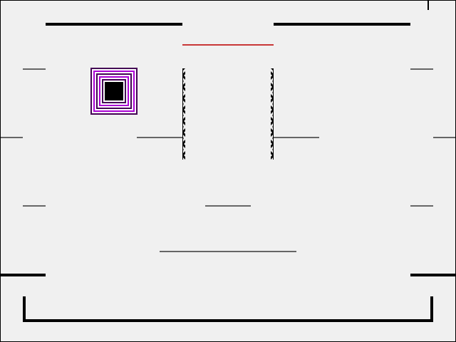
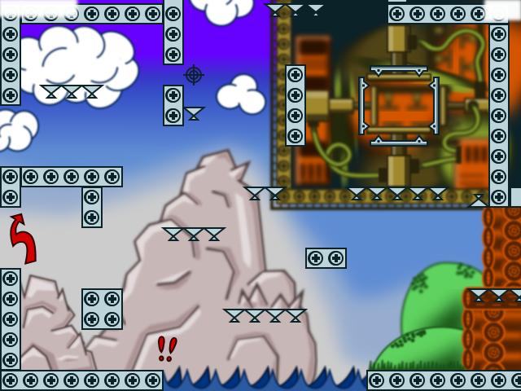

# Projectile

A totally legit pygame game

(But very much in alpha.)

## Installation

### Getting pygame on Linux

See [pygame docs](http://www.pygame.org/wiki/GettingStarted).

### Getting pygame on MacOS

MacOS doesn't have python3 by default. An easy way to get it is with
[Homebrew](https://brew.sh/). From a terminal, install Homebrew:

```
$> /usr/bin/ruby -e "$(curl -fsSL https://raw.githubusercontent.com/Homebrew/install/master/install)"
$> brew update
```

Then, install python3:

```
$> brew install python3
```

Then, use pip to install pygame:

```
$> pip3 install pygame
```

### Getting pygame on Windows

These instructions are for Windows 7.
They might also work for later versions of Windows.

Windows doesn't have python3 by default.
Download the installer for the latest version of Python 3.6 from [here](https://www.python.org/downloads/).

Then, run the installer.
Make sure to check the "Add Python 3.6 to PATH" box, and click "Install Now."
See [Python documentation](https://docs.python.org/3/using/windows.html#installation-steps) for more details.

When Python has finished installing, click on the Start Menu, type `cmd.exe`, and hit `[enter]`.
This opens a terminal.
To install pygame, type

```
py -m pip install pygame --user
```

and hit `[enter]`.

You can check that it worked by running the Aliens game included with pygame:

```
py -m pygame.examples.aliens
```

See also [pygame documentation](http://pygame.org/wiki/GettingStarted#Windows%20installation).

### Getting Projectile on Linux and MacOS

Clone the game's repository to a suitable location:

```
$> git clone https://github.com/etomzak/projectile.git projectile_trunk
```

### Getting Projectile on Windows

At the top of the [Projectile project page](https://github.com/etomzak/projectile) (probably the same page that you're reading this text on), click "Clone or download," then "Download ZIP."
It will download a file named `projectile-master.zip`.

Once it's finished downloading, open your Downloads folder.
Right-click on `projectile-master.zip`, and click "Extract all..."
Choose where to extract the game to with "Browse."
It doesn't really matter where you put it as long as you can find it.

## Running the game

### On Linux and MacOS

From a terminal:

```
$> cd projectile_trunk
$> ./projectile-game.py
```

A short help page is available with

```
$> ./projectile-game.py -h
```

### On Windows

Navigate to the folder where you extracted `projectile-master.zip`.
Then, open the folder `projectile-master`.
There is another folder in there named `projectile-master`.
Open that one as well.

Then, find the file named `projectile-game.py` (or just `projectile-game`).
Double-click it to start the game.

## Playing the game

Projectile is a simple platformer where you jump around and shoot at stuff.
The game is composed of levels, players, baddies, and projectiles.
You control a player and shoot projectiles at baddies.
Baddies shoot projectiles back at you.
Killing baddies gives you points.
Getting killed by baddies makes you lose the game.
My current personal best for the default, unmodified game is 3945 points.

The game has been designed to make it easy to add new players, baddies, projectiles, and levels.
Currently there are two each of players, baddies, projectiles, and levels.

### Controls

| Key | Action |
|-----|--------|
|:arrow_left::arrow_right:| Move |
|:arrow_up::arrow_down:   | Look up, look down |
| [space] | Jump  |
| f       | Shoot |
| p       | Pause |
| q       | Quit  |

### Cast

#### Players

| Player | Description |
|--------|-------------|
|  | **Fred** is your garden-variety stick figure guy. He's trying to get back his gold or rescue the princess or something. Fred starts out with 20 health and shoots BBs by default. |
|  | **Ilmar** is a tank. He can't be hurt by projectiles, and he shoots slugs by default. Every time he fires, there is a 10% chance that the projectile will backfire and Ilmar will blow up. |

#### Baddies

| Baddie | Description |
|--------|-------------|
|  | **Kreutzwald** is an angry-looking balloon, but he can't actually hurt you. He has 1 health and is worth 5 points. |
|  | **XOR** is an aggressive machine thing that shoots BBs at you as it flies around. It has a small attack surface and is difficult to hit. It has 3 health and is worth 20 points. |

#### Projectiles

| Projectile | Description |
|------------|-------------|
|  | **BB**s are the most basic projectile. They cause 1 damage. A BB power-up has 30 BBs, and normally a player can have 10 BBs in flight at once.
|  | **Slug**s are heavy projectiles that do 5 damage. A slug power-up has 10 slugs, and a player can normally have 5 slugs in flight at once. |

#### Levels

| Level | Description |
|-------|-------------|
|  | **Zero** is a simple level with some barriers. |
|  | **BigRock** is a hectic level with a picture of a big rock in the background. |
