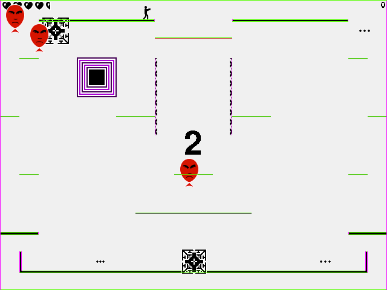
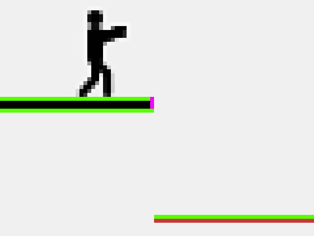
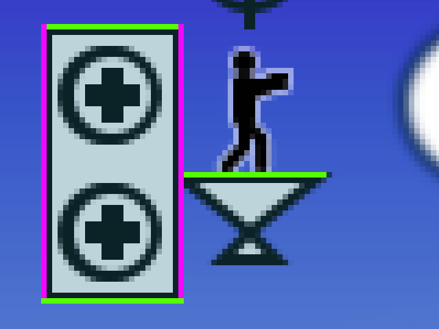
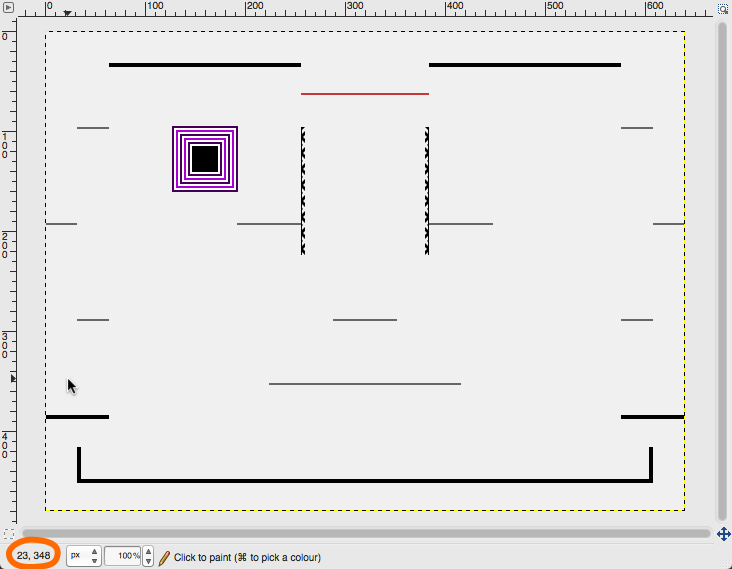

# Level Creation Tutorial

This tutorial will show you how to create your own level.
It will introduce you to writing some extremely simple code.
You will need to draw a backdrop image for your level, and the tutorial assumes that you already know how to use the basic features of some drawing program to do this.
I use [GIMP](https://www.gimp.org) and [Inkscape](https://www.inkscape.org), but even Microsoft Paint will do the trick.

The tutorial will explain the components of a level.
The most difficult of these is the barriers in the level that create the level's geometry.
The tutorial ends with a walkthrough of the process of creating a brand-new level.

## What's in a level?

When the game loads a level, the level needs to tell the game six things:

1. Background image
2. Barriers
3. Player spawn point
4. Baddie spawn point
5. Power-up spawn point
6. Number of baddies

Take a look at the level definition file `Levels/zero.py`.
This file defines level Zero.
This code:

```python
        CountdownLevel.__init__(self, "Level_Zero.png", baddie_classes,
            power_ups, player_projectile_group, decoration_list)
```

tells the `CountdownLevel` class to use `Level_Zero.png` as the background image for the level.
It also tells the `CountdownLevel` class about various important lists used in the game, but they are beyond the scope of this tutorial.

Wherever you see code that starts with `self.floors.add(...`, `self.ceilings.add(...`, `self.l_walls.add(...`, or `self.r_walls.add(...`, it is `zero.py` telling the game where in the level barriers are located.

The location in the level where baddies are spawned is defined by:

```python
        self._baddie_spawn_x = 160
        self._baddie_spawn_y = 128
```

The location where the player starts is:

```python
        self.player_spawn_x = 18
        self.player_spawn_y = 350
```

The location where power-ups are spawned is:

```python
        self._pu_spawn_x = 480
        self._pu_spawn_y = 128
```

Finally, the maximum number of baddies in the level is given by:

```python
        self._max_baddies = 5
```

This is all the information that the level definition file needs to provide.

## Barriers

This section gives an overview of barriers and explains the different types of barriers.

### Understanding barriers

The most important part of level design is placing barriers.
Barriers block players, baddies, and projectiles.
Without barriers, the game is just one, big, open area.

The most confusing thing about level design is that the level background image _has nothing to do with barriers_; the background image is just a picture.
In the case of level Zero, `Level_Zero.png` is a picture that just shows the player where the barriers are, but `zero.py` is the file that tells the game where the barriers actually are.
You could open `Level_Zero.png` in an image editor and completely change it.
This would not change the geometry of level Zero&mdash;how the player and baddies can move around the level.
All it would do is confuse the person playing the game, because the image wouldn't match the under-the-hood level description.
You could also open `zero.py` and change the barriers.
This would change what it's like to play level Zero, but not what level Zero looks like.
Again, this will confuse the person playing the game.
When you're designing a level, you need to make sure that the level image and the level description file match up (unless you're trying to make a very confusing level...).

To better understand the difference between the level image and the level definition file, you can do this:
Open `Classes/level.py` and find the `draw()` function (it starts with `def draw(self, screen):`).
Then add a call do the `dbg_draw()` function to the end of the `draw()` function so that the `draw()` function looks like this:

```python
    def draw(self, screen):
        """
        Draw stuff.
        """

        for s in self._decoration_list:
            s.draw_decoration(screen)
        self._power_ups.draw(screen)
        self.baddies.draw(screen)
        self.baddie_projectiles.draw(screen)
        self._player_group.draw(screen)
        self._player_projectile_group.draw(screen)
        self.dbg_draw(screen) # <-- Add this line
```

Save `level.py` and run the game.
You will see that the game has drawn green and purple lines all over the level.
This is where the game has put the barriers based on the code in the level definition file (e.g., `zero.py` or `bigRock.py`).
You can see that the barriers line up with objects in the level image.

If you didn't bother doing the above, here is a screenshot of level Zero with barriers drawn:



### Barrier types

The game has four types of barriers:

* Floors
* Ceilings
* Left walls
* Right walls

Floors and ceilings are horizontal; left walls and right walls are vertical.
Each barrier type blocks a player or baddie from moving in one direction:
floors prevent a character from moving down, ceilings prevent a character from moving up, left walls prevent a character from moving right, and right walls prevent a character from moving left.
Projectiles can't tell the difference between floors and ceilings, or left walls and right walls&mdash;floors and ceilings will both block a projectile from going up or down, and left walls and right walls will both block a projectile from going left or right.

Here is a zoomed-in version of the above screenshot from level Zero:



Fred is standing on a floor barrier (green).
Underneath the floor barrier is another green barrier, a ceiling barrier.
If you've played level Zero, you'll know that you can't jump up through the thick, black platforms.
It's this ceiling barrier at the bottom of the platform that prevents characters from going through.
The very short, vertical, purple barrier connecting the floor and ceiling is a right wall (or r\_wall).
It prevents a character from moving into the platform from the right.

The horizontal red line in level Zero is a lone ceiling.
It allows the player to drop down through it, but not to jump up through it.
You can also see this red line and where the game thinks the ceiling barrier is placed in the above zoomed-in image.

Here is another zommed-in screenshot, this time from the BigRock level:



Fred is standing on a platform that is a lone floor barrier.
This means that Fred can jump up through the barrier, but can't fall back down through the barrier.
Next to Fred is a block that is completely surrounded by barriers.
There is a floor barrier at the top, a ceiling barrier at the bottom, an l\_wall on the left, and an r\_wall on the right.
It's important to note that the barriers overlap in the corners&mdash;the top-left corner of the block, for example, is both a floor and an l\_wall.
You can only see the l\_wall in the corner pixel, because l\_walls are drawn after and on top of floors (see `dbg_draw()` in `level.py`).
If the barriers didn't overlap in the corners, then it would be possible for a diagonally moving player to slip into the block through the corner.

## Making your first level

To make a level, you need an image, and you need code.

### Making the image

The first step to making your own level is drawing an image for the level.
Use whatever drawing program you like.
The image must be exactly 640 pixels wide and 480 pixels high.
The image can be plain, like level Zero, or more snazzy, like level BigRock.
There are some things you should keep in mind when designing a level:

* Where will the player spawn at the start of the game?
* Where will the baddies spawn?
* Where will power-ups appear?
* Are the barriers close enough that the player can jump from barrier to barrier?
* Are the barriers far enough that players and baddies can fit between them?
* Will you use lone barriers that characters can pass through?
* Will you use barrier blocks made up of floors, ceilings, l\_walls, and r\_walls?
* Will you use both lone barriers and barrier blocks?
* Do your lone barriers and barrier blocks look different?
* Will your level image be decorated and have a theme?
* Can someone playing your level tell the difference between things that are barriers and things that are just decorations?

Once you have finished drawing your image, save it into the `Images` directory as a PNG file.

### Writing the code

The code portion of the level tells the game where the barriers are in your level and where to spawn stuff.
The quickest way to get started writing the code for a new level is to copy an existing level.
This is similar to how you copied an existing character in the [Player cloning tutorial](Player_Clone.md).

Go to the `Levels` directory, copy `zero.py`, and rename it to your level name.
For example, if your level is named "Exciting," you would call the file `exciting.py`.
Then, open the file, find where it says `class Zero(CountdownLevel):` and replace that with `class Exciting(CountdownLevel):`.
Finally, find where the file says `"Level_Zero.png"`, and replace that with the name of your level image file that you saved in the last section.
Be careful not to accidentally delete the quotes (`"`).

At this point, the game will happily load your new level.
If your level is named `Exciting`, you can run the game from the command line like this:

```
$> ./projectile-game -l Exciting
```

The game will load what looks like your level, but if you try to play it, you'll find that it still has the geometry of level Zero and plays like level Zero.
The player character starts where it does in level Zero, the baddies and power-ups spawn where they do in level Zero, and the barriers are in the same places as in level Zero.
This is because `exciting.py` still just contains the code for level Zero.

To change the spawn points, find the code that sets them (see "What's in a level?" above).
Baddies, players, and power-ups each have an x-coordinate and a y-coordinate.
X-coordinates range from 0 at the left of the level image to 639 at the right of the image.
Y-coordinates range from 0 at the top of the image to 479 at the bottom.
Most image editors will tell you the coordinates for pixels.
For example, in the following screenshot, I have opened `Level_Zero.png` in GIMP.
The lower left corner of the screen (circled in orange) tells me that my cursor is pointing at the x-coordinate 23 and y-coordinate 348.



In your level image, find the locations where you want baddies, players, and power-ups to spawn, and put those coordinates into your level description file.

Next, there's a variable that sets the maximum number of baddies that a level can have: `self._max_baddies = 5`.
This is set to five in level Zero, but you can set it to another value.

Finally, there's the finicky task of adding all the barriers in your level into the description file.
The "Understanding barriers" section above described four types of barriers: floors, ceilings, l\_walls, and r\_walls.
Under the hood, horizontal barriers (floors and ceilings) are of the `Platform` class, and vertical barriers (l\_walls and r\_walls) are of the `Wall` class.
You can add barriers like this:

```python
        self.floors.add(Platform(36, 448, 568))     # Add a floor
        self.ceilings.add(Platform(32, 451, 576))   # Add a ceiling
        self.l_walls.add(Wall(32, 416, 36))         # Add an l_wall
        self.r_walls.add(Wall(35, 416, 32))         # Add an r_wall
```

When adding a floor or ceiling, use `Platform`.
When adding an l\_wall or r\_wall, use `Wall`.
The three numbers in a barrier declaration are its left x-coordinate, its top y-coordinate, and its size.
For platforms, the size is the width in pixels, and for walls, the size is the height in pixels.

For example, a barrier declared as `Platform(5, 6, 10)` has an x-coordinate of 5, a y-coordinate of 6, and is 10 pixels wide.
When using an image editor to measure the sizes of your barriers, it's easy to accidentally make the barriers one pixel too small.
If you see a floor that has its first pixel at x-coordinate 5, y-coordinate 6, and has its last pixel at x-coordinate 14, y-coordinate 6, it's easy to accidentally think that the floor is 9 pixels wide (because `14 - 5 = 9`).
In this case, the floor is actually 10 pixels wide, because the last pixel is included in the size.
(Draw this out and count the pixels if you don't believe me.)
The correct formula for the width or height of a barrier is `(width or height) = last_pixel + 1 - first_pixel`.

You can add more than one barrier with each call to `add()`:

```python
        self.floors.add(Platform(36, 448, 568),   # a , instead of a )
                        Platform(32, 416, 4),     # no opening ( and , at end of line
                        Platform(604, 416, 4))    # no opening ( and an extra closing )
```

Before you add your barriers into your level description file, make sure to delete all the barriers left over from Zero.

By default, the `Level` class (through the `CountdownLevel` class) provides a set of barriers around the level image that prevents sprites from leaving the screen area.
You can remove these barriers by putting this code after the call to `CountdownLevel.__init__()` and before any barrier `add()` calls (see `Levels/bigRock.py`):

```python
        self.floors = pygame.sprite.Group()
        self.ceilings = pygame.sprite.Group()
        self.l_walls = pygame.sprite.Group()
        self.r_walls = pygame.sprite.Group()
```

If you do this, _you must place your own barriers that prevent sprites from leaving the level area_.
Otherwise, players, baddies, and projectiles can keep moving indefinitely off-screen, and the game won't work correctly.

Once you've finished writing your level's code, spend some time playing the level to make sure it works as you expect.
You can always go back and change the image and code to improve the level.

